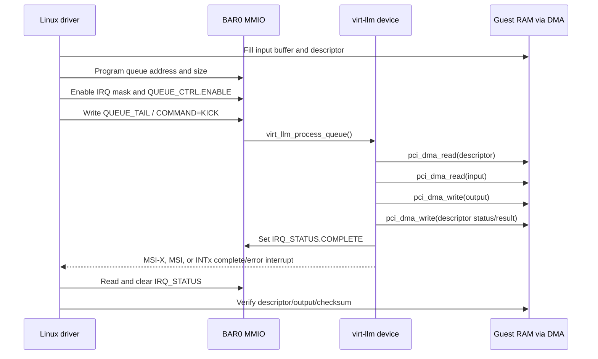
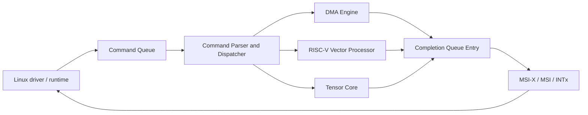

# virt-llm Architecture

## Current Scope

`virt-llm` is a QEMU PCI device that simulates the control path of a future LLM
inference accelerator. The current implementation focuses on hardware/software
plumbing rather than real model execution.

It currently validates:

- PCI device enumeration.
- BAR0 MMIO register access.
- Guest-to-device doorbell state.
- Guest-owned DMA descriptor queue.
- Queue enable/reset/status/error control.
- Device DMA reads and writes through `pci_dma_read()` and `pci_dma_write()`.
- Completion interrupts through MSI-X, MSI, or INTx fallback.
- A deterministic simulated inference command.
- A DMA engine command.
- A RISC-V vector backend command.
- A tensor core backend command.
- A tensor core 2D convolution command.
- Completion queue entries for every parsed command.
- An invalid-opcode descriptor error path.

## Source Locations

QEMU:

- Device model: `hw/misc/virt_llm.c`
- Build integration: `hw/misc/meson.build`
- Kconfig integration: `hw/misc/Kconfig`
- Planning docs: `virt_llm.md`, `virt_llm_queue_dma.md`

Linux side used for validation:

- Driver: `drivers/misc/virt_llm_pci.c`
- Kconfig: `drivers/misc/Kconfig`
- Makefile: `drivers/misc/Makefile`

## PCI Identity

| Field | Value |
| --- | --- |
| QEMU device name | `virt-llm` |
| Vendor ID | `0x1b36` |
| Device ID | `0x1100` |
| PCI class | `PCI_CLASS_OTHERS` |
| BAR0 | 4 KiB MMIO |
| MSI-X vectors | 1 |
| MSI vectors | 1 |
| INTx pin | INTA |

The QEMU command-line shape is:

```bash
-device virt-llm
```

## Device State

Current `VirtLLMState` contains:

| Field | Purpose |
| --- | --- |
| `PCIDevice parent_obj` | QEMU PCI base object |
| `MemoryRegion mmio` | BAR0 MMIO region |
| `doorbell` | Legacy self-test register state |
| `queue_addr` | Guest physical DMA address of descriptor ring |
| `queue_size` | Number of descriptors in ring |
| `queue_head` | Device-consumed descriptor index |
| `queue_tail` | Guest-produced descriptor index |
| `irq_status` | Pending interrupt cause bits |
| `irq_mask` | Enabled interrupt cause bits |
| `queue_ctrl` | Queue enable/reset control |
| `queue_status` | Queue enabled/error state |
| `queue_error` | Last queue error code |

## BAR0 Register Map

All registers are currently 32-bit little-endian accesses.

| Offset | Name | Access | Description |
| --- | --- | --- | --- |
| `0x00` | `MAGIC` | RO | Returns `0x4c4c4d31` (`LLM1`) |
| `0x04` | `VERSION` | RO | Returns `3` |
| `0x08` | `DOORBELL` | RW | Legacy self-test input |
| `0x0c` | `STATUS` | RO | Returns `DOORBELL ^ 0xa5a5a5a5` |
| `0x10` | `FEATURES` | RO | Queue, MSI, and MSI-X support bits |
| `0x14` | `QUEUE_SIZE` | RW | Number of descriptors |
| `0x18` | `QUEUE_ADDR_LO` | RW | Low 32 bits of descriptor queue DMA address |
| `0x1c` | `QUEUE_ADDR_HI` | RW | High 32 bits of descriptor queue DMA address |
| `0x20` | `QUEUE_HEAD` | RO | Device-consumed index |
| `0x24` | `QUEUE_TAIL` | RW | Guest-produced index; write triggers processing |
| `0x28` | `IRQ_STATUS` | RW1C | Completion interrupt status |
| `0x2c` | `IRQ_MASK` | RW | Interrupt enable mask |
| `0x30` | `COMMAND` | WO | `1` kicks queue processing |
| `0x34` | `ABI` | RO | ABI version, currently `1` |
| `0x38` | `QUEUE_MAX` | RO | Maximum queue depth, currently `1024` |
| `0x3c` | `XFER_MAX` | RO | Maximum transfer length, currently `4096` |
| `0x40` | `IRQ_VEC` | RO | Available interrupt vectors, currently `1` |
| `0x44` | `QUEUE_CTRL` | RW | Queue enable/reset bits |
| `0x48` | `QUEUE_STATUS` | RO | Queue enabled/error status |
| `0x4c` | `QUEUE_ERROR` | RO | Last queue error code |
| `0x50` | `CQ_SIZE` | RW | Number of completion queue entries |
| `0x54` | `CQ_ADDR_LO` | RW | Low 32 bits of completion queue DMA address |
| `0x58` | `CQ_ADDR_HI` | RW | High 32 bits of completion queue DMA address |
| `0x5c` | `CQ_HEAD` | RW | Guest-consumed completion index |
| `0x60` | `CQ_TAIL` | RO | Device-produced completion index |

Feature bits:

| Bit | Name | Meaning |
| --- | --- | --- |
| 0 | `QUEUE` | DMA descriptor queue exists |
| 1 | `MSI` | Device advertises MSI support |
| 2 | `MSI-X` | Device advertises MSI-X support |
| 3 | `QCTRL` | Queue control/status/error registers exist |
| 4 | `CQ` | Completion queue registers and entries exist |

Interrupt bits:

| Bit | Name | Meaning |
| --- | --- | --- |
| 0 | `COMPLETE` | At least one descriptor completed |
| 1 | `ERROR` | At least one descriptor or queue error occurred |

Queue control bits:

| Bit | Name | Meaning |
| --- | --- | --- |
| 0 | `ENABLE` | Queue may consume ready descriptors |
| 1 | `RESET` | Reset queue registers, status, and error |

Queue status bits:

| Bit | Name | Meaning |
| --- | --- | --- |
| 0 | `ENABLED` | Queue is enabled |
| 1 | `ERROR` | Queue has reported an error |

Queue error codes:

| Value | Meaning |
| --- | --- |
| `0` | No queue error |
| `1` | Invalid queue configuration |
| `2` | Invalid descriptor |
| `3` | Unsupported descriptor opcode |

## Descriptor ABI

The queue points to an array of packed 64-byte descriptors:

```c
struct virt_llm_desc {
    uint32_t opcode;
    uint32_t flags;
    uint64_t input_addr;
    uint64_t output_addr;
    uint32_t len;
    uint32_t status;
    uint32_t result;
    uint32_t rsvd0;
    uint64_t rsvd1;
    uint64_t rsvd2;
    uint64_t rsvd3;
};
```

The completion queue points to an array of compact 32-byte entries:

```c
struct virt_llm_cpl {
    uint32_t command_id;
    uint32_t opcode;
    uint32_t backend;
    uint32_t status;
    uint32_t result;
    uint32_t q_head;
    uint64_t rsvd0;
};
```

Current opcodes:

| Opcode | Name | Backend | Behavior |
| --- | --- | --- | --- |
| `0x0001` | `INFER_XOR` | compatibility | DMA-read input, write `input[i] ^ 0x5a` to output, return checksum |
| `0x0010` | `DMA_COPY` | DMA engine | Copy `len` bytes from input to output and return byte checksum |
| `0x0100` | `VECTOR_ADD_U32` | RISC-V vector | Add two u32 arrays and return output checksum |
| `0x0101` | `SOFTMAX_Q16` | RISC-V vector | Normalize u32 inputs into Q16 probabilities |
| `0x0102` | `POOL_MAX_U32` | RISC-V vector | Max-pool u32 windows |
| `0x0103` | `DOT_U32` | RISC-V vector | Dot product over two u32 arrays |
| `0x0200` | `GEMM_U32` | tensor core | Run a small u32 GEMM and return output checksum |
| `0x0201` | `CONV2D_U32` | tensor core | Run valid u32 2D convolution and return output checksum |

Tensor `CONV2D_U32` uses `input_addr` as the input image matrix, `rsvd1` as
the kernel matrix address, and `output_addr` as the output matrix address.
`rsvd2` packs input and kernel dimensions as `in_h[15:0]`, `in_w[31:16]`,
`kernel_h[47:32]`, and `kernel_w[63:48]`. `rsvd3` packs output dimensions as
`out_h[15:0]` and `out_w[31:16]`. The first implementation supports valid
convolution with stride 1 and no padding.

Descriptor flags:

| Bit | Name | Meaning |
| --- | --- | --- |
| 0 | `READY` | Guest has finished writing the descriptor |

Current status values:

| Value | Meaning |
| --- | --- |
| `1` | Descriptor complete |
| `0x80000001` | Invalid descriptor or unsupported opcode |
| `0x80000002` | Unsupported opcode |
| `0x80000003` | Invalid transfer length or DMA buffer address |

## Command Lifecycle



## Interrupt Model

The device initializes both MSI and MSI-X capability:

- MSI: one vector through `msi_init()`.
- MSI-X: one vector through `msix_init_exclusive_bar()`.
- INTx: fallback through `pci_set_irq()`.

Completion path:

1. QEMU sets `IRQ_STATUS.COMPLETE` for successful descriptors or
   `IRQ_STATUS.ERROR` for descriptor/queue errors.
2. If the matching mask bit is set:
   - notify MSI-X vector 0 when MSI-X is enabled;
   - else notify MSI vector 0 when MSI is enabled;
   - else assert INTx.
3. Driver clears observed IRQ status bits with write-one-to-clear.
4. QEMU deasserts INTx when no interrupt status remains.

## Linux Driver Contract

The validation driver is expected to:

1. Enable the PCI device.
2. Call `pci_set_master()` so the device can issue DMA.
3. Set a 32-bit coherent DMA mask.
4. Map BAR0.
5. Verify `MAGIC` and legacy `DOORBELL`/`STATUS`.
6. Allocate coherent queue, input, and output buffers.
7. Allocate MSI-X/MSI, falling back to INTx.
8. Enable the queue through `QUEUE_CTRL.ENABLE`.
9. Submit one ready descriptor.
10. Wait for interrupt-driven completion.
11. Verify descriptor status, output bytes, and checksum for compatibility,
    DMA copy, vector add, and GEMM commands.
12. Submit an unsupported opcode descriptor and verify the error interrupt,
    descriptor status, queue status, and queue error code.

## Current Limitations

- Queue ownership exists through a descriptor READY flag, but there is no
  device-owned completion flag yet.
- Queue processing is synchronous inside MMIO write handling.
- There is only one queue and one interrupt vector.
- Error reporting is still coarse and should grow per-cause codes.
- There is no userspace interface yet.
- There is no QEMU migration state.
- There are no QEMU trace events for queue or interrupt activity.
- The simulated inference command is a deterministic byte transform, not a
  model-oriented token interface.

## Recommended Target Architecture

The next stable shape should look like this:

- BAR0 remains the control register aperture.
- Queue configuration becomes explicit: command queue reset, command queue
  enable, completion queue reset, queue status, queue depth, and queue error.
- Descriptors gain ownership, command ids, richer status codes, and completion
  queue entries.
- Interrupt causes are split into command completion, queue error, device
  error, backend error, and reset completion.
- QEMU moves command completion toward an asynchronous model using a timer or
  bottom half when latency simulation is enabled.
- Linux grows a userspace entry point after the kernel self-test path is solid.

That architecture keeps the current bring-up path intact while creating a
natural route toward a usable simulated LLM accelerator.

## Target Accelerator Architecture

The intended LLM PCIe accelerator is organized around a hardware command queue
front end. The queue front end does not execute every command itself. It parses
each command descriptor, checks ownership and bounds, then dispatches the work
to the correct internal execution block according to `opcode`.



Execution blocks:

| Block | Responsibility | Example opcodes |
| --- | --- | --- |
| Command parser | Descriptor ownership, opcode decode, bounds checks, backend dispatch | all commands |
| DMA engine | Simple memory movement and fill/copy style commands | `DMA_COPY`, `DMA_FILL` |
| RISC-V vector processor | Elementwise/vector kernels that map naturally to vector lanes | `VECTOR_ADD`, `SOFTMAX`, `POOLING` |
| Tensor core | Matrix/tensor kernels with high arithmetic intensity | `GEMM`, future attention kernels |
| Completion queue writer | Writes compact completion records and raises interrupts | all commands |

### Command Queue and Completion Queue

The current prototype stores completion status directly back into each command
descriptor. The target architecture should add a separate completion queue so
software can submit many commands and consume completions independently.

Command queue entry responsibilities:

- command id supplied by the driver/runtime;
- opcode and flags;
- DMA input/output addresses;
- payload length or element count;
- backend-specific arguments packed into reserved fields;
- ownership bit from guest to device.

Completion queue entry responsibilities:

- command id;
- completion status;
- backend id;
- result or checksum;
- optional profiling fields such as cycles, bytes moved, or synthetic latency.

The first implementation can keep descriptor inline completion for backward
compatibility while adding CQ fields later.

### Opcode Dispatch Policy

Proposed opcode ranges:

| Range | Backend | Purpose |
| --- | --- | --- |
| `0x0000_0001` | Compatibility path | Existing XOR inference self-test |
| `0x0000_0010` - `0x0000_00ff` | DMA engine | copy, fill, scatter/gather later |
| `0x0000_0100` - `0x0000_01ff` | RISC-V vector processor | vector add, softmax, pooling |
| `0x0000_0200` - `0x0000_02ff` | Tensor core | GEMM and future tensor kernels |
| `0x0000_ffff` | Test/error path | intentionally unsupported command |

Initial concrete opcodes:

| Opcode | Name | Backend | First validation behavior |
| --- | --- | --- | --- |
| `0x0001` | `INFER_XOR` | compatibility | byte-wise XOR transform |
| `0x0010` | `DMA_COPY` | DMA engine | copy `len` bytes from input to output |
| `0x0100` | `VECTOR_ADD_U32` | RISC-V vector | add two u32 arrays |
| `0x0101` | `SOFTMAX_Q16` | RISC-V vector | fixed-point softmax approximation |
| `0x0102` | `POOL_MAX_U32` | RISC-V vector | max-pooling over u32 windows |
| `0x0200` | `GEMM_U32` | tensor core | small unsigned integer GEMM |

Implemented opcode status:

| Opcode | Status |
| --- | --- |
| `INFER_XOR` | implemented and validated |
| `DMA_COPY` | implemented and validated |
| `VECTOR_ADD_U32` | implemented and validated |
| `SOFTMAX_Q16` | implemented and validated |
| `POOL_MAX_U32` | implemented and validated |
| `DOT_U32` | implemented and validated |
| `GEMM_U32` | implemented and validated |

### Backend Simulation Model

The QEMU model should keep backend functions small and deterministic:

- the DMA engine performs direct `pci_dma_read()` and `pci_dma_write()`;
- the vector processor backend is represented by helper functions such as
  `virt_llm_vector_add_u32()`;
- the tensor core backend is represented by helper functions such as
  `virt_llm_tensor_gemm_u32()`;
- every backend returns a common status code and result checksum;
- debug output or tracepoints should identify command id, opcode, backend,
  status, and bytes/elements processed.

The model should not try to emulate a real RISC-V vector ISA pipeline yet. The
first target is architectural separation: commands that would run on the vector
processor are dispatched to a vector backend, and tensor-heavy commands are
dispatched to a tensor backend.

### Descriptor Argument Convention

The existing 64-byte descriptor can carry the first backend experiments:

| Field | Common meaning |
| --- | --- |
| `opcode` | command opcode |
| `flags` | ownership and command flags |
| `input_addr` | first input buffer |
| `output_addr` | output buffer |
| `len` | bytes or element count depending on opcode |
| `status` | inline status for compatibility |
| `result` | checksum or scalar result |
| `rsvd0` | command id mirrored into the CQ entry |
| `rsvd1` | second input address or backend argument |
| `rsvd2` | packed dimensions or backend argument |
| `rsvd3` | extra backend argument |

This let the QEMU model add DMA copy, vector add, and GEMM without breaking the
current Linux driver. A later ABI revision should rename these reserved fields
into explicit command fields.
