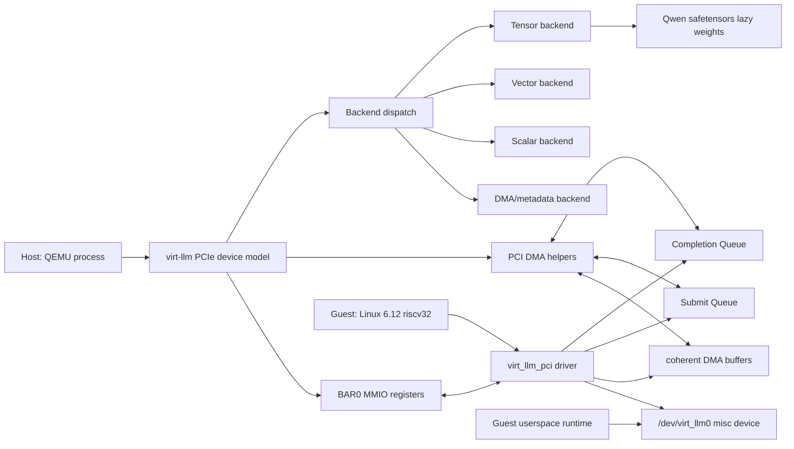

# virt-llm 系统架构、运行原理与后续计划

生成时间：2026-06-07

## 1. 系统目标

`virt-llm` 是一个 QEMU PCIe 虚拟设备项目，用来模拟未来 LLM 推理加速卡的软硬件接口和执行路径。它的重点不是先做高性能，而是先把硬件/driver/runtime 的边界建立清楚：

- guest Linux 能枚举一个 PCIe endpoint；
- driver 能通过 BAR/MMIO 配置队列、DMA buffer 和中断；
- userspace 能通过 `/dev/virt_llm0` 提交算子命令；
- QEMU 设备能解析 command descriptor、执行对应 backend、写 completion queue；
- 最终能用真实模型权重和真实算子图完成最小 LLM 推理。

当前阶段已经能跑通 Qwen2.5-0.5B Instruct 固定 prompt 的 1-token exact-match 推理。

## 2. 总体架构



主链路：

1. guest userspace 打开 `/dev/virt_llm0`。
2. userspace 通过 ioctl 分配 coherent DMA buffer。
3. userspace 在 DMA buffer 内填入 token、tensor request 或 activation。
4. userspace 提交 `virt_llm_user_desc`。
5. Linux driver 将 handle 翻译为 DMA address，写入 submit queue。
6. Linux driver 写 BAR0 `Q_TAIL` 和 `COMMAND=KICK`。
7. QEMU 设备读取 SQ descriptor，按 opcode dispatch。
8. QEMU 通过 `pci_dma_read()` 把 guest DMA 内容复制到 QEMU host heap。
9. QEMU host CPU 执行对应算子。
10. QEMU 通过 `pci_dma_write()` 写回 guest DMA output buffer。
11. QEMU 写 completion queue，更新 descriptor status，触发 interrupt。
12. driver/userspace 读取 CQ，判断完成状态和结果。

## 3. PCIe 设备抽象

### 3.1 PCIe endpoint

QEMU 内的设备模型位于：

```text
/home/qemu/qemu/hw/misc/virt_llm.c
```

设备抽象包括：

- PCI endpoint config space。
- PCI vendor/device：Red Hat vendor，device `0x1100`。
- BAR0 MMIO register space。
- BAR1 MSI-X table/PBA。
- DMA-capable device model。
- queue state。
- interrupt state。
- model weight state。
- backend dispatch。

### 3.2 BAR 空间

当前 BAR 设计：

| BAR | 用途 | 大小/性质 |
|---|---|---|
| BAR0 | `virt-llm-mmio` 控制寄存器 | 4 KiB，little-endian，32-bit MMIO |
| BAR1 | MSI-X table/PBA | QEMU PCI MSI-X 使用 |

中断能力：

- QEMU 设备提供 MSI-X exclusive BAR，当前 vectors=1。
- Linux driver 优先申请 MSI-X/MSI；如果不可用则 fallback 到 INTx。
- completion/error notification 当前都通过 `IRQ_STS`、`IRQ_MASK` 和 CQ 状态完成。

BAR0 主要寄存器定义在 `/home/qemu/qemu/hw/misc/virt_llm.c` 开头：

| offset | register | 作用 |
|---:|---|---|
| `0x00` | `MAGIC` | 设备 magic，当前为 `0x4c4c4d31` |
| `0x04` | `VERSION` | 设备版本 |
| `0x08` | `DOORBELL` | 兼容 doorbell |
| `0x0c` | `STATUS` | 状态/doorbell 派生值 |
| `0x10` | `FEATURES` | 能力 bit |
| `0x14` | `Q_SIZE` | submit queue size |
| `0x18` | `Q_LO` | SQ DMA base low |
| `0x1c` | `Q_HI` | SQ DMA base high |
| `0x20` | `Q_HEAD` | device consumed SQ head |
| `0x24` | `Q_TAIL` | driver produced SQ tail |
| `0x28` | `IRQ_STS` | interrupt status |
| `0x2c` | `IRQ_MASK` | interrupt mask |
| `0x30` | `COMMAND` | command kick |
| `0x34` | `ABI` | ABI version |
| `0x38` | `Q_MAX` | max queue depth |
| `0x3c` | `XFER_MAX` | max transfer size |
| `0x44` | `Q_CTRL` | queue enable/reset |
| `0x48` | `Q_STATUS` | queue status |
| `0x4c` | `Q_ERROR` | queue error code |
| `0x50` | `CQ_SIZE` | completion queue size |
| `0x54` | `CQ_LO` | CQ DMA base low |
| `0x58` | `CQ_HI` | CQ DMA base high |
| `0x5c` | `CQ_HEAD` | driver consumed CQ head |
| `0x60` | `CQ_TAIL` | device produced CQ tail |
| `0x64`-`0x8c` | scalar/kernel metadata | scalar dispatcher kernel table |

## 4. Command Queue 和 Completion Queue

### 4.1 guest UAPI descriptor

userspace 看到的描述符定义在：

```text
/home/qemu/linux-6.12/include/uapi/linux/virt_llm.h
```

核心结构：

```c
struct virt_llm_user_desc {
    __u32 opcode;
    __u32 flags;
    __u32 input_handle;
    __u32 output_handle;
    __u32 len;
    __u32 command_id;
    __u32 rsvd0;
    __u32 rsvd1_handle;
    __u32 rsvd2_handle;
    __u32 reserved;
    __u64 rsvd1_addr;
    __u64 rsvd2_addr;
    __u64 rsvd3;
};
```

userspace 不直接把裸 DMA address 塞进 descriptor，而是传 `input_handle`、`output_handle`、`rsvd*_handle`。driver 在内核态把 handle 翻译为 coherent DMA address。

### 4.2 device descriptor

driver 写入 SQ 的 device-side descriptor 位于：

```text
/home/qemu/linux-6.12/drivers/misc/virt_llm_pci.c
```

结构：

```c
struct virt_llm_desc {
    __le32 opcode;
    __le32 flags;
    __le64 input_addr;
    __le64 output_addr;
    __le32 len;
    __le32 status;
    __le32 result;
    __le32 rsvd0;
    __le64 rsvd1;
    __le64 rsvd2;
    __le64 rsvd3;
} __packed;
```

### 4.3 completion entry

completion entry 包含：

- `command_id`
- `opcode`
- `backend`
- `status`
- `result`
- `q_head`
- `q_error`

它用于验证命令是否由正确 backend 执行、是否完成、是否出错。

### 4.4 queue 执行过程

QEMU 设备处理队列的核心逻辑在：

```text
/home/qemu/qemu/hw/misc/virt_llm.c
```

流程摘要：

```text
virt_llm_process_queue()
  while queue_head != queue_tail:
    pci_dma_read(SQ descriptor)
    check READY
    dispatch by opcode
    write descriptor status
    pci_dma_write(SQ descriptor)
    queue_head++
    write CQ entry
    raise IRQ or set queue error
```

当 driver 写 `Q_TAIL` 或 `COMMAND=KICK` 时，QEMU 会触发 `virt_llm_process_queue()`。

## 5. Backend 分工

当前 backend 编码：

| backend | 编码 | 作用 |
|---|---:|---|
| COMPAT | 0 | 兼容旧 `INFER_XOR` |
| DMA | 1 | DMA copy、模型 load/query、metadata |
| VECTOR | 2 | elementwise、norm、RoPE、SwiGLU、argmax |
| TENSOR | 3 | GEMM、CONV、attention、LM head |
| SCALAR | 4 | scalar dispatcher，解析 kernel metadata 后转发 toy vector ops |

QEMU dispatch 当前映射：

| opcode | backend | 说明 |
|---|---|---|
| `INFER_XOR` | COMPAT | 早期 smoke op |
| `DMA_COPY` | DMA | DMA copy |
| `VEC_ADD_U32`、`DOT_U32`、`SOFTMAX_Q16`、`POOL_MAX_U32` | SCALAR | scalar dispatcher 查 kernel table |
| `GEMM_U32`、`CONV2D_U32`、`ATTENTION_Q16` | TENSOR | toy tensor ops |
| `MODEL_LOAD`、`MODEL_QUERY` | DMA | 模型加载和查询 |
| `EMBED_LOOKUP_F32`、`RMSNORM_F32`、`ROPE_F32`、`ADD_F32`、`SWIGLU_F32`、`ARGMAX_F32` | VECTOR | Qwen vector ops |
| `GEMM_F32`、`LM_HEAD_F32`、`QWEN_GQA_ATTENTION_F32` | TENSOR | Qwen tensor ops |

## 6. 数据流

### 6.1 DMA buffer 是什么

Linux driver 使用 `dma_alloc_coherent()` 分配 coherent DMA memory。对于 QEMU guest 来说，这些 buffer 是 guest physical memory 中的 DMA-visible 区域；对于 QEMU host 来说，`pci_dma_read()`/`pci_dma_write()` 会访问 guest address space。

userspace 看到的是 driver 返回的 buffer handle。runtime 通过 `mmap(fd, ..., pgoff=handle-1)` 把该 coherent DMA buffer 映射到 guest userspace，然后在映射后的虚拟地址里写 token、tensor request 或读取输出。提交 command 时，userspace 只传 handle；driver 在内核态把 handle 翻译成 DMA address。

当前不是 zero-copy：

```text
guest coherent DMA buffer
  -- pci_dma_read() -->
QEMU host heap temporary buffer
  -- host CPU compute -->
QEMU host heap output buffer
  -- pci_dma_write() -->
guest coherent DMA output buffer
```

activation 当前在 guest DMA buffer 之间流转。QEMU 执行算子时通常复制输入到 host heap，计算完成后再写回 guest DMA buffer。

### 6.2 模型权重流

Qwen safetensors 模型文件不进入 git，也不是 guest 上传。当前由 QEMU device property 或环境变量指定：

```bash
VIRT_LLM_MODEL_PATH=/path/to/qwen2.5-0.5b-instruct/model.safetensors
```

脚本会把它传给 QEMU：

```text
-device virt-llm,model-path=/path/to/model.safetensors
```

QEMU `MODEL_LOAD` 后建立模型 metadata/tensor table。GEMM、RMSNorm、embedding 等算子通过 tensor id 找到权重，必要时 lazy load BF16 权重并转换到 FP32 host buffer。

## 7. 控制流

### 7.1 基础 GEMM 控制流

以 `GEMM_U32` selftest 为例：

1. Linux driver 在 probe selftest 中准备 A/B 输入和 output buffer。
2. driver 填 SQ descriptor：
   - `opcode = VIRT_LLM_OP_GEMM_U32`
   - `input_addr = input_dma`
   - `rsvd1 = input_b_dma`
   - `output_addr = output_dma`
   - `rsvd2` 中编码 `m/n/k`
3. driver 写 `Q_TAIL` 和 `COMMAND=KICK`。
4. QEMU 读取 descriptor。
5. QEMU dispatch 到 `virt_llm_process_gemm_u32()`。
6. QEMU `pci_dma_read()` A/B。
7. QEMU 在 host CPU 上计算 2x2 GEMM。
8. QEMU `pci_dma_write()` C。
9. QEMU 写 CQ，backend 为 `TENSOR`，status 为 `DESC_COMPLETE`。
10. driver 检查 output checksum：`0x00000086`。

### 7.2 Qwen 最小推理控制流

guest runtime 位于：

```text
/home/qemu/linux-6.12/tools/testing/selftests/virt_llm/virt-llm-qwen.c
```

固定输入：

- prompt：`What is the capital of France?`
- token count：36
- expected first token：785
- decode steps：1

Qwen forward 每层执行：

```text
embedding
for layer in 0..23:
  RMSNorm(input)
  GEMM q_proj + bias
  GEMM k_proj + bias
  GEMM v_proj + bias
  RoPE(q)
  RoPE(k)
  Qwen GQA attention(q,k,v)
  GEMM o_proj
  residual add
  RMSNorm(post-attn)
  GEMM gate_proj
  GEMM up_proj
  SwiGLU
  GEMM down_proj
  residual add
final RMSNorm
LM head
argmax
```

成功条件：

```text
output_tokens[0] == 785
```

成功 marker：

```text
QWEN_INFER_OK input_tokens=... output_tokens=785
```

## 8. 模块结构

### 8.1 QEMU 侧

| 模块 | 路径 | 作用 |
|---|---|---|
| PCIe device model | `/home/qemu/qemu/hw/misc/virt_llm.c` | BAR/MMIO、queue、DMA、backend dispatch、算子实现 |
| model reference | `/home/qemu/qemu/tools/virt_llm/model_reference.py` | host Transformers golden 生成 |
| build initramfs | `/home/qemu/qemu/tools/virt_llm/build_initramfs.sh` | 编译 guest freestanding init 并打包 initramfs |
| Linux build helper | `/home/qemu/qemu/tools/virt_llm/build_linux_6_12_rv32.sh` | 构建 Linux 6.12 riscv32 Image |
| basic validation | `/home/qemu/qemu/tools/virt_llm/run_virt_llm_validation.sh` | 启动 QEMU 跑基础 probe/GEMM/attention |
| Qwen validation | `/home/qemu/qemu/tools/virt_llm/run_virt_llm_qwen.sh` | 启动 QEMU 跑 Qwen exact-match gate |
| fresh repro | `/home/qemu/qemu/tools/virt_llm/reproduce_fresh_virt_llm.sh` | 从 GitHub fresh clone/build/test |

### 8.2 Linux 侧

| 模块 | 路径 | 作用 |
|---|---|---|
| UAPI | `/home/qemu/linux-6.12/include/uapi/linux/virt_llm.h` | ioctl、opcodes、descriptor、tensor request |
| PCI driver | `/home/qemu/linux-6.12/drivers/misc/virt_llm_pci.c` | probe、BAR map、DMA、SQ/CQ、IRQ、misc device |
| basic userspace test | `/home/qemu/linux-6.12/tools/testing/selftests/virt_llm/virt-llm-test.c` | info/GEMM/attention/basic op 测试 |
| console runtime | `/home/qemu/linux-6.12/tools/testing/selftests/virt_llm/virt-llm-console.c` | 手动输入命令测试 |
| Qwen runtime | `/home/qemu/linux-6.12/tools/testing/selftests/virt_llm/virt-llm-qwen.c` | 固定 prompt Qwen per-op graph |

## 9. 当前没有模拟的硬件

当前还没有真实模拟：

- device-side DDR 容量和地址空间；
- on-chip SRAM/scratchpad；
- cache hierarchy；
- DMA engine latency；
- PCIe bandwidth、packet、credit、backpressure；
- tensor core cycle-level pipeline；
- vector core instruction execution；
- RISC-V scalar control core firmware；
- command processor 独立线程/异步执行；
- power/thermal/performance counters。

现在的 backend 是 QEMU host CPU 上的函数级模拟，重点是 ABI、控制流、数据流和正确性。

## 10. 待改进项

### P0：推理正确性扩展

- 增加 per-layer golden checksum。
- 对齐每层 residual、attention output、MLP output、final logits。
- 支持 `max_new_tokens=8`，先继续 full-context recompute。
- 把 tokenizer/chat template 做成 host-generated fixture 或 guest CLI 输入。

### P1：硬件真实性

- 增加 device memory abstraction：model memory、activation arena、KV cache arena。
- 增加 SRAM/scratchpad 模型。
- 增加 asynchronous worker，把 MMIO kick 和 op execution 解耦。
- 增加 queue depth、backpressure、interrupt coalescing。
- 增加 latency accounting 和 tracepoints。

### P1：LLM runtime

- 实现 KV cache。
- 支持 prefill/decode 两条路径。
- 支持多 token greedy decode。
- 支持 logits top-k/top-p sampling。
- 支持任意 prompt 输入。

### P2：性能和数据类型

- 从 FP32 runtime 逐步迁移到 BF16/Q8/Q16。
- 增加 blocked GEMM。
- 增加 host CPU 多线程 tensor backend。
- 可选 CUDA backend，但不作为 correctness baseline。

### P2：工程化

- 把 fresh clone validation 做成 CI 或周期性本地验证。
- 增加 negative tests：bad tensor id、bad shape、bad dtype、buffer too small。
- 增加 docs 中公司内网复现步骤。
- 清理旧 build 输出和历史 helper 脚本。

## 11. 建议下一步计划

### Milestone 1：从 1-token 到 8-token

目标：固定 prompt，`max_new_tokens=8`，仍使用 full-context recompute。

工作：

- host reference 生成 8-token golden。
- guest runtime `QWEN_DECODE_STEPS=8`。
- validation 检查完整 token sequence。
- 若分叉，输出每 step 的 logits top-k。

验收：

```text
QWEN_DECODE_OK tokens=<8 token ids>
QWEN_INFER_OK ...
```

### Milestone 2：per-layer golden 调试框架

目标：定位和验证每层数值。

工作：

- host reference 导出 layer-level checksum。
- guest/QEMU 每层可选打印 checksum。
- validation 比较 layer checksum。

验收：

- 至少覆盖 embedding、每层 attention output、每层 MLP output、final logits。

### Milestone 3：KV cache

目标：decode 阶段不再每步重算完整上下文。

工作：

- 定义 KV cache tensor ABI。
- QEMU 支持 cache write/read。
- guest runtime 分 prefill 和 decode。

验收：

- 与 full-context recompute token sequence 一致。
- 日志显示 KV cache writes/reads。

### Milestone 4：device memory model

目标：更接近真实加速卡。

工作：

- 引入 model memory、activation arena、SRAM scratchpad。
- 明确 host DMA upload 与 device local memory 的关系。
- 增加容量限制和错误路径。

验收：

- 模型权重和 activation 不再只是散落在 guest DMA buffer/QEMU heap。
- buffer overflow 和 capacity error 可验证。

### Milestone 5：性能模拟

目标：具备基本性能分析能力。

工作：

- 异步 command worker。
- op latency 模型。
- queue occupancy/backpressure。
- command trace。
- tokens/sec 输出。

验收：

- correctness baseline 不变。
- 每个 op 有 start/end trace 和 latency。
