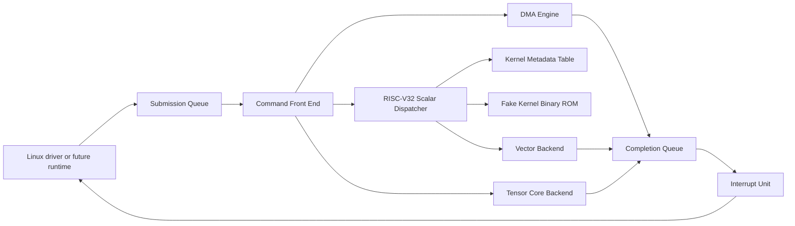
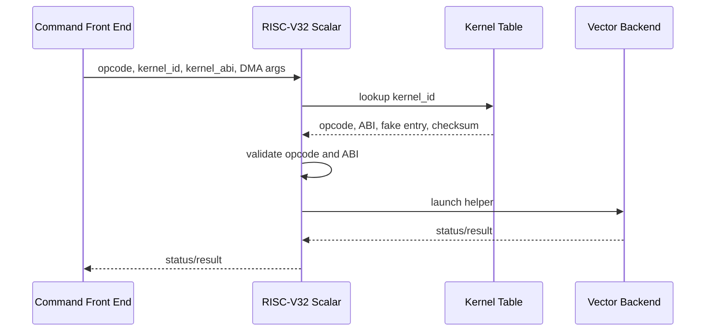

# virt-llm Architecture V2 Review Draft

## Goal

`virt-llm` is evolving from a minimal PCIe device into a small simulated LLM
accelerator card. The near-term architecture should model the control path of a
real card:

- PCIe command submission from Linux;
- hardware command parsing in QEMU;
- direct DMA execution for simple memory commands;
- RISC-V32 scalar control for vector kernels;
- vector backend execution for elementwise and reduction kernels;
- tensor core backend execution for GEMM and CONV;
- completion queue and interrupt delivery for every command.

The next design step adds a kernel metadata table to the scalar dispatcher so
vector commands are selected through a firmware-like ABI rather than a raw
hard-coded switch.

## Block Diagram



## Hardware Responsibilities

| Block | Responsibility |
| --- | --- |
| PCIe front end | BAR registers, queue addresses, queue control, interrupt masks |
| Command front end | Descriptor fetch, ownership check, opcode class decode |
| DMA engine | Direct copy or simple memory movement commands |
| RISC-V32 scalar dispatcher | Kernel lookup, ABI validation, vector backend launch |
| Kernel metadata table | Built-in kernel id, opcode, ABI, entry, size, checksum |
| Vector backend | Deterministic vector add, dot, softmax, and pooling helpers |
| Tensor core backend | Deterministic GEMM and valid CONV2D helpers |
| Completion unit | CQ entry writeback, inline descriptor status, interrupt cause |

## Opcode Routing

| Opcode range | Current opcodes | Route |
| --- | --- | --- |
| `0x0000..0x00ff` | `INFER_XOR`, `DMA_COPY` | compatibility or DMA |
| `0x0100..0x01ff` | `VECTOR_ADD_U32`, `DOT_U32`, `SOFTMAX_Q16`, `POOL_MAX_U32` | scalar dispatcher then vector backend |
| `0x0200..0x02ff` | `GEMM_U32`, `CONV2D_U32` | tensor core backend |
| other | none | unsupported opcode completion |

Vector commands are intentionally routed through the scalar dispatcher. Tensor
commands bypass it because the command front end can send them directly to the
tensor core command interface.

## Descriptor ABI

The 64-byte descriptor remains the base ABI:

```c
struct virt_llm_desc {
    uint32_t opcode;
    uint32_t flags;
    uint64_t input_addr;
    uint64_t output_addr;
    uint32_t len;
    uint32_t status;
    uint32_t result;
    uint32_t command_id;
    uint64_t aux_addr;
    uint64_t args0;
    uint64_t args1;
};
```

The C field names in QEMU/Linux may still use `rsvd0`, `rsvd1`, `rsvd2`, and
`rsvd3`, but Architecture V2 treats them as ABI fields:

| ABI name | Existing field | Meaning |
| --- | --- | --- |
| `command_id` | `rsvd0` | Completion queue command id |
| `aux_addr` | `rsvd1` | Second input, kernel address, or backend-specific address |
| `args0` | `rsvd2` | Packed dimensions or command arguments |
| `args1` | `rsvd3` | Kernel selector or backend-specific arguments |

## Scalar Kernel ABI

For vector commands, `args1` is interpreted as:

| Bits | Name | Meaning |
| --- | --- | --- |
| `0..15` | `kernel_id` | Built-in scalar kernel id |
| `16..23` | `kernel_abi` | Required kernel ABI, `0` means default |
| `24..31` | `dispatch_flags` | Reserved for future debug or async behavior |
| `32..63` | reserved | Must be zero for now |

The scalar dispatcher must validate:

- selected kernel exists;
- selected kernel supports the descriptor opcode;
- selected kernel ABI matches the descriptor request;
- descriptor length and DMA addresses are valid for that kernel.

Only after validation does it launch the vector backend helper.

## Kernel Metadata Table

The built-in table is the bridge toward future uploaded kernels:



Initial entries:

| Kernel id | Name | Opcode | ABI | Fake entry |
| --- | --- | --- | --- | --- |
| `1` | `vec_add_u32` | `0x0100` | `1` | `0x1000` |
| `2` | `dot_u32` | `0x0103` | `1` | `0x1100` |
| `3` | `softmax_q16` | `0x0101` | `1` | `0x1200` |
| `4` | `pool_max_u32` | `0x0102` | `1` | `0x1300` |

The fake entry values are not guest physical addresses. They are internal
accelerator instruction memory offsets for debug and future simulation.

## Register Map Extension

Architecture V2 keeps all existing registers stable. It adds a readout window
for the selected kernel table slot:

| Offset | Register | Access | Description |
| --- | --- | --- | --- |
| `0x74` | `KERNEL_INDEX` | RW | Selected kernel metadata slot |
| `0x78` | `KERNEL_ID` | RO | Kernel id |
| `0x7c` | `KERNEL_OPCODE` | RO | Supported opcode |
| `0x80` | `KERNEL_ABI` | RO | ABI version |
| `0x84` | `KERNEL_ENTRY` | RO | Fake entry point |
| `0x88` | `KERNEL_SIZE` | RO | Fake binary size |
| `0x8c` | `KERNEL_CHECKSUM` | RO | Fake binary checksum |

Out-of-range `KERNEL_INDEX` reads should return zero metadata and should not set
queue error state, because metadata discovery is not command execution.

## Completion and Error Model

Completion queue entries remain the source of command completion truth:

| Field | Meaning |
| --- | --- |
| `command_id` | Driver-provided id from descriptor |
| `opcode` | Submitted opcode |
| `backend` | Compatibility, DMA, scalar, vector, or tensor |
| `status` | Descriptor completion status |
| `result` | Checksum, scalar result, or backend-specific value |
| `q_head` | Queue head after completion |

Architecture V2 separates these cases:

| Case | Status | Queue error |
| --- | --- | --- |
| Unknown opcode | `DESC_UNSUPP` | opcode error |
| Known vector opcode but bad kernel id | `DESC_BAD_KERNEL` | kernel error |
| Known vector opcode but ABI mismatch | `DESC_BAD_KERNEL` | kernel error |
| Bad DMA length or address | `DESC_BAD_LEN` | descriptor error |
| Successful command | `DESC_COMPLETE` | none |

## Data Flow Examples

### Vector Add

1. Linux fills input A, input B, output buffer, and descriptor.
2. Descriptor opcode is `VECTOR_ADD_U32`.
3. `args1.kernel_id` selects `vec_add_u32`.
4. Command front end sends request to scalar dispatcher.
5. Scalar dispatcher validates kernel metadata.
6. Vector backend writes output and checksum.
7. CQ entry reports backend `SCALAR` and status `COMPLETE`.

### GEMM

1. Linux fills matrix A, matrix B, output matrix C, and packed dimensions.
2. Descriptor opcode is `GEMM_U32`.
3. Command front end sends request directly to tensor core backend.
4. Tensor core helper computes deterministic u32 GEMM.
5. CQ entry reports backend `TENSOR`.

### CONV2D

1. Linux fills input matrix, kernel matrix, output matrix, and dimensions.
2. Descriptor opcode is `CONV2D_U32`.
3. Command front end sends request directly to tensor core backend.
4. Tensor core helper computes valid convolution with stride 1 and no padding.
5. CQ entry reports backend `TENSOR`.

## Validation Strategy

Every architecture step should keep the same validation rhythm:

1. Build `qemu-system-riscv32`.
2. Build Linux 6.12 riscv32 `Image`.
3. Boot Linux 6.12 under QEMU with `-device virt-llm`.
4. Verify driver probe self-tests.
5. Verify the final log contains `INITRAMFS_OK`.
6. Push QEMU after successful validation.
7. Push Linux validation driver when that iteration modifies driver behavior.

## Proposed Next Milestone

The first Architecture V2 implementation milestone is complete:

1. Add the QEMU kernel metadata table.
2. Add kernel metadata registers.
3. Add Linux driver metadata discovery self-test.
4. Do not enforce ABI mismatch yet.
5. Validate boot.

Validation passed with:

```text
virt_llm_pci ... kernel table ok: kernels=4 abi=1 first_entry=0x00001000 last_entry=0x00001300
INITRAMFS_OK: Linux 6.12 booted on QEMU riscv32
```

The next milestone can enforce kernel ABI validation and add negative tests.
