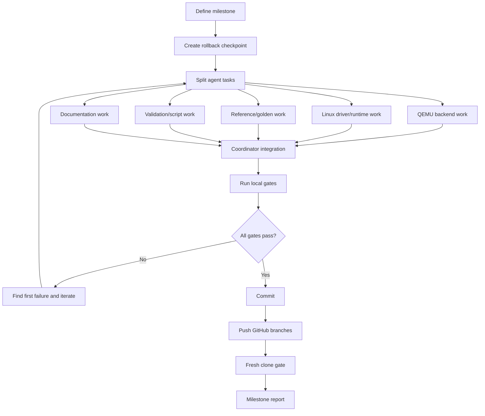

# virt-llm Multi-Agent Continuous Development Guide

Last updated: 2026-06-08

## 1. Goal

Future `virt-llm` work should use a coordinator plus multiple agents. The goal
is not cosmetic parallelism. The goal is to split QEMU device modeling, Linux
driver/runtime work, host reference generation, validation, and documentation
into independent workstreams that can be developed, verified, and rolled back
cleanly.

Core requirements:

1. Every milestone has a clear owner and acceptance gate.
2. Every agent has a non-overlapping write scope.
3. The coordinator owns integration, conflict resolution, final build/test,
   commits, and pushes.
4. A task is not complete until the milestone gate passes.
5. Documentation and validation scripts must move with code changes.

## 2. Recommended Agent Roles

| Agent | Responsibility | Default write scope |
|---|---|---|
| Milestone Coordinator | Task split, conflict management, integration, final gates, commit/push | Global, but only during integration |
| ABI/Docs Steward | Own register/opcode/descriptor/CQ/error semantics and freeze visible ABI | ABI tables, architecture docs, plan docs; no one-sided breaking code |
| QEMU Backend Agent | PCIe device, BARs, queues, DMA, backends, opcodes, model loader | `hw/misc/virt_llm.c`, QEMU trace/config |
| Linux Driver Agent | Linux driver, UAPI, DMA buffers, ioctls, probe selftests | Linux driver/UAPI/selftest files |
| Guest Runtime Agent | `virt-llm-test`, console, Qwen runtime, decode loop | `tools/testing/selftests/virt_llm/*` |
| Reference Agent | Host golden data, model inspector, per-layer checksums, converter | `tools/virt_llm/model_reference.py`, fixtures, reference docs |
| Validation Agent | Build/run/fresh-clone scripts, log parsing, negative tests | `tools/virt_llm/*` scripts |
| RISC-V Platform Agent | riscv32/riscv64 builds, initramfs, boot arguments, cross compiler settings | `tools/virt_llm/common.sh`, Linux/QEMU build scripts |
| Fresh Clone/Repro Agent | fresh clone, intranet mirror variables, summary/log rules, dependency audit | `tools/virt_llm/reproduce_fresh_*.sh`, `env.example` |
| Docs Agent | Chinese/English docs, release notes, diagrams, user guides | `virt_llm*.md` |
| Review/Gate Agent | Read-only gate review, ABI drift, repro gaps, failure owner assignment | Read-only by default; may write gate reports |

## 3. Work Split Rules

Before a milestone starts, the coordinator must define:

1. The milestone goal and non-goals.
2. Each agent's exact task.
3. The file paths each agent may write.
4. The file paths each agent must not write.
5. The gates that must pass.
6. The rollback checkpoint: starting QEMU and Linux commits.

Example:

```text
Milestone: KV cache decode
QEMU Backend Agent:
  Write: hw/misc/virt_llm.c
  Do not write: Linux runtime
Linux Driver Agent:
  Write: Linux UAPI and driver files
  Do not write: QEMU backend
Validation Agent:
  Write: tools/virt_llm/run_*.sh
Docs Agent:
  Write: virt_llm_*_zh.md and virt_llm_*_en.md
Gate:
  - rv32 basic PASS
  - rv64 basic PASS
  - Qwen 8-token full-context PASS
  - Qwen KV decode PASS
```

## 4. Continuous Development Flow



## 5. Required Gates

Every milestone should run at least:

```bash
cd /home/qemu/qemu
tools/virt_llm/build_qemu_virt_llm.sh
```

```bash
cd /home/qemu/qemu
VIRT_LLM_GUEST_BITS=32 tools/virt_llm/run_virt_llm_validation.sh
```

```bash
cd /home/qemu/qemu
VIRT_LLM_GUEST_BITS=64 tools/virt_llm/run_virt_llm_validation.sh
```

If the change touches Qwen, tensor backends, model loading, guest runtime, or
reference generation:

```bash
cd /home/qemu/qemu
VIRT_LLM_MODEL_PATH=/home/zyz/llmsim/models/qwen2.5-0.5b-instruct/model.safetensors \
  tools/virt_llm/run_virt_llm_qwen.sh
```

If the change touches build scripts, environment variables, external
dependencies, or reproduction commands:

```bash
cd /home/qemu/qemu
REPORT_DIR=/tmp/virt-llm-platform-repro \
  tools/virt_llm/reproduce_fresh_virt_llm_platform.sh
```

## 6. Success Markers

Basic platform:

```text
probe ok:
gemm ok:
attention q16 ok:
INITRAMFS_OK: Linux 6.12 booted on QEMU riscv32
INITRAMFS_OK: Linux 6.12 booted on QEMU riscv64
```

Qwen correctness:

```text
qwen model load ok
qwen full layers ok
QWEN_INFER_OK ... output_tokens=785,6722,315,9625,374,12095,13,151645
```

Fresh clone:

```text
Conclusion: PASS
```

## 7. ABI and Documentation Freeze Rules

Any change to register offsets, opcodes, descriptor fields, CQ entries, feature
bits, error codes, or tensor request ABI must first be written down by the
ABI/Docs Steward:

1. old vs new ABI;
2. QEMU implementation location;
3. Linux driver/runtime implementation location;
4. compatibility and error semantics;
5. matching Chinese and English documentation updates.

## 8. Conflict Control Rules

1. Agents must not revert each other's work.
2. Agents must not modify files outside their assigned scope.
3. Cross-scope edits go through the coordinator.
4. Before integration, the coordinator must inspect `git status --short` and
   run `git diff --check`.
5. Build outputs, logs, model files, and caches must not be committed.
6. Existing untracked build directories such as `build-riscv64-user/` remain
   excluded.

## 9. Commit and Push Rules

Every milestone should produce at least one QEMU commit. If Linux changes are
needed, Linux gets a separate commit.

QEMU:

```bash
cd /home/qemu/qemu
git status --short
git add <intended files>
git commit -m "virt-llm-<milestone-name>"
git push supercatking HEAD:llmdev
```

Linux:

```bash
cd /home/qemu/linux-6.12
git status --short
git add <intended files>
git commit -m "virt-llm-<milestone-name>"
git push supercatking HEAD:llmdev-linux-6.12
```

## 10. Documentation Sync Rules

Each code change must decide whether these documents need updates:

- `virt_llm_platform_setup_zh.md`
- `virt_llm_platform_setup_en.md`
- `virt_llm_platform_architecture_zh.md`
- `virt_llm_platform_architecture_en.md`
- `virt_llm_project_plan_zh.md`
- `virt_llm_project_plan_en.md`
- `virt_llm_multi_agent_development_zh.md`
- `virt_llm_multi_agent_development_en.md`
- `virt_llm_developer_guide_zh.md`
- `virt_llm_developer_guide_en.md`
- `virt_llm_docs_index.md`

Documentation is not secondary in this project. Scripts, docs, and gates are
part of the reproducibility contract.
