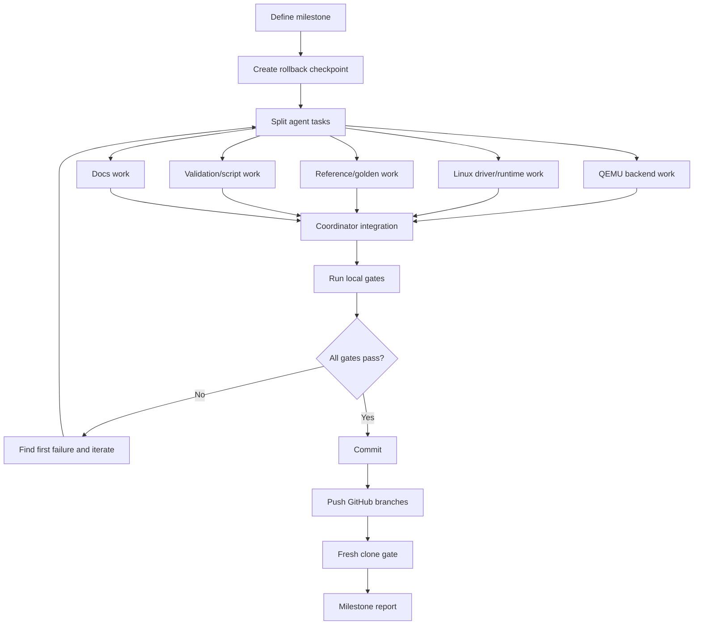

# virt-llm 多 Agent 持续开发规范

更新时间：2026-06-08

## 1. 目标

`virt-llm` 后续开发必须采用“主协调者 + 多 agents”的持续开发模式。目标不是形式上并行，而是把 QEMU 设备模型、Linux driver/runtime、host reference、验证脚本和文档维护拆成可并行、可验证、可回退的工作单元。

核心要求：

1. 每个 milestone 都要有明确 owner 和验收 gate。
2. 每个 agent 的写入范围必须互不重叠。
3. 主协调者负责集成、冲突处理、最终 build/test/commit/push。
4. 没有达到当前 milestone gate 时不能把任务标记为完成。
5. 文档和验证脚本必须跟随代码同步更新。

## 2. 推荐 Agent 角色

| Agent | 主要职责 | 默认写入范围 |
|---|---|---|
| Milestone Coordinator | 拆分任务、管理冲突、集成结果、运行最终 gate、commit/push | 全局，但只在集成阶段写入 |
| ABI/Docs Steward | 维护 register/opcode/descriptor/CQ/error 语义，冻结 QEMU/Linux 可见 ABI | ABI 表、架构文档、计划文档；不单边落地破坏性代码 |
| QEMU Backend Agent | `virt-llm` PCIe 设备、BAR、queue、DMA、backend、opcode、模型加载 | `hw/misc/virt_llm.c`、QEMU 相关 trace/config |
| Linux Driver Agent | Linux driver、UAPI、DMA buffer、ioctl、selftest | Linux repo 中 driver/UAPI/selftest |
| Guest Runtime Agent | `virt-llm-test`、console、Qwen runtime、decode loop | `tools/testing/selftests/virt_llm/*` |
| Reference Agent | host golden、model inspector、per-layer checksum、converter | `tools/virt_llm/model_reference.py`、fixtures、reference docs |
| Validation Agent | build/run/fresh clone scripts、log parser、negative tests | `tools/virt_llm/*` scripts |
| RISC-V Platform Agent | riscv32/riscv64 构建、initramfs、boot 参数、cross compile 配置 | `tools/virt_llm/common.sh`、Linux/QEMU build scripts |
| Fresh Clone/Repro Agent | fresh clone、内网镜像变量、summary/log 规则、依赖审计 | `tools/virt_llm/reproduce_fresh_*.sh`、`env.example` |
| Docs Agent | 中英文文档、release notes、架构图、操作手册 | `virt_llm*.md` |
| Review/Gate Agent | 只读审查 gate、ABI drift、复现缺口、失败 owner | 默认只读，可写 gate report |

## 3. 工作拆分规则

每次 milestone 开始前，Coordinator 必须定义：

1. 当前 milestone 的目标和非目标。
2. 每个 agent 的具体任务。
3. 每个 agent 可以写的文件路径。
4. 每个 agent 禁止修改的文件路径。
5. 当前必须通过的 gate。
6. 回退点：开始前的 QEMU/Linux commit。

示例：

```text
Milestone: KV cache decode
QEMU Backend Agent:
  Write: hw/misc/virt_llm.c
  Do not write: Linux runtime
Linux Driver Agent:
  Write: Linux UAPI and driver files
  Do not write: QEMU backend
Validation Agent:
  Write: tools/virt_llm/run_*.sh
Docs Agent:
  Write: virt_llm_*_zh.md and virt_llm_*_en.md
Gate:
  - rv32 basic PASS
  - rv64 basic PASS
  - Qwen 8-token full-context PASS
  - Qwen KV decode PASS
```

## 4. 持续开发流程



## 5. 必跑 Gate

每个 milestone 至少执行：

```bash
cd /home/qemu/qemu
tools/virt_llm/build_qemu_virt_llm.sh
```

```bash
cd /home/qemu/qemu
VIRT_LLM_GUEST_BITS=32 tools/virt_llm/run_virt_llm_validation.sh
```

```bash
cd /home/qemu/qemu
VIRT_LLM_GUEST_BITS=64 tools/virt_llm/run_virt_llm_validation.sh
```

如果修改 Qwen、tensor backend、model loader、runtime 或 reference：

```bash
cd /home/qemu/qemu
VIRT_LLM_MODEL_PATH=/home/zyz/llmsim/models/qwen2.5-0.5b-instruct/model.safetensors \
  tools/virt_llm/run_virt_llm_qwen.sh
```

如果修改构建脚本、环境变量、依赖、文档中的复现命令：

```bash
cd /home/qemu/qemu
REPORT_DIR=/tmp/virt-llm-platform-repro \
  tools/virt_llm/reproduce_fresh_virt_llm_platform.sh
```

## 6. 成功标记

基础平台：

```text
probe ok:
gemm ok:
attention q16 ok:
INITRAMFS_OK: Linux 6.12 booted on QEMU riscv32
INITRAMFS_OK: Linux 6.12 booted on QEMU riscv64
```

Qwen correctness：

```text
qwen model load ok
qwen full layers ok
QWEN_INFER_OK ... output_tokens=785,6722,315,9625,374,12095,13,151645
```

fresh clone：

```text
Conclusion: PASS
```

## 7. ABI 和文档冻结规则

任何 register offset、opcode、descriptor 字段、CQ entry、feature bit、error code、tensor request ABI 的变化，必须先由 ABI/Docs Steward 写清楚：

1. 新旧 ABI 差异。
2. QEMU 侧实现位置。
3. Linux driver/runtime 侧实现位置。
4. 兼容性和错误语义。
5. 对应中英文文档更新。

## 8. 冲突控制规则

1. agents 不允许互相 revert。
2. agents 不允许修改未分配给自己的文件范围。
3. 如果需要跨范围修改，必须交给 Coordinator。
4. Coordinator 集成前必须检查 `git status --short` 和 `git diff --check`。
5. build output、临时日志、模型文件、cache 不能纳入提交。
6. `build-riscv64-user/` 等既有未跟踪 build 目录继续排除。

## 9. 提交和 Push 规则

每个 milestone 至少一个 QEMU commit；如果 Linux 也改动，则 Linux 单独 commit。

QEMU：

```bash
cd /home/qemu/qemu
git status --short
git add <intended files>
git commit -m "virt-llm-<milestone-name>"
git push supercatking HEAD:llmdev
```

Linux：

```bash
cd /home/qemu/linux-6.12
git status --short
git add <intended files>
git commit -m "virt-llm-<milestone-name>"
git push supercatking HEAD:llmdev-linux-6.12
```

## 10. 文档同步规则

每次代码变更必须判断是否需要更新：

- `virt_llm_platform_setup_zh.md`
- `virt_llm_platform_setup_en.md`
- `virt_llm_platform_architecture_zh.md`
- `virt_llm_platform_architecture_en.md`
- `virt_llm_project_plan_zh.md`
- `virt_llm_project_plan_en.md`
- `virt_llm_multi_agent_development_zh.md`
- `virt_llm_multi_agent_development_en.md`
- `virt_llm_developer_guide_zh.md`
- `virt_llm_developer_guide_en.md`
- `virt_llm_docs_index.md`

文档不是附属物。对于这个项目，文档、脚本和 gate 是可复现性的核心组成部分。

## 11. 当前推荐下一步

1. M2：per-layer golden 调试框架。
2. M3：KV cache 与 prefill/decode 分离。
3. M4：device memory arena 和 SRAM scratchpad 抽象。
4. M5：异步 command worker、queue backpressure、trace/latency。
5. M6：BF16/Q8/Q16 数据类型扩展。
6. M7：CI 和公司内网复现闭环。
