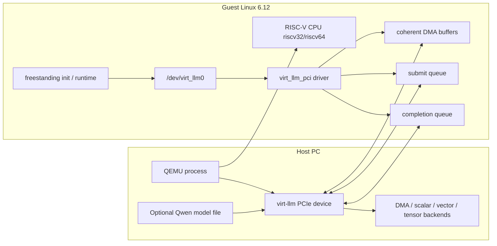
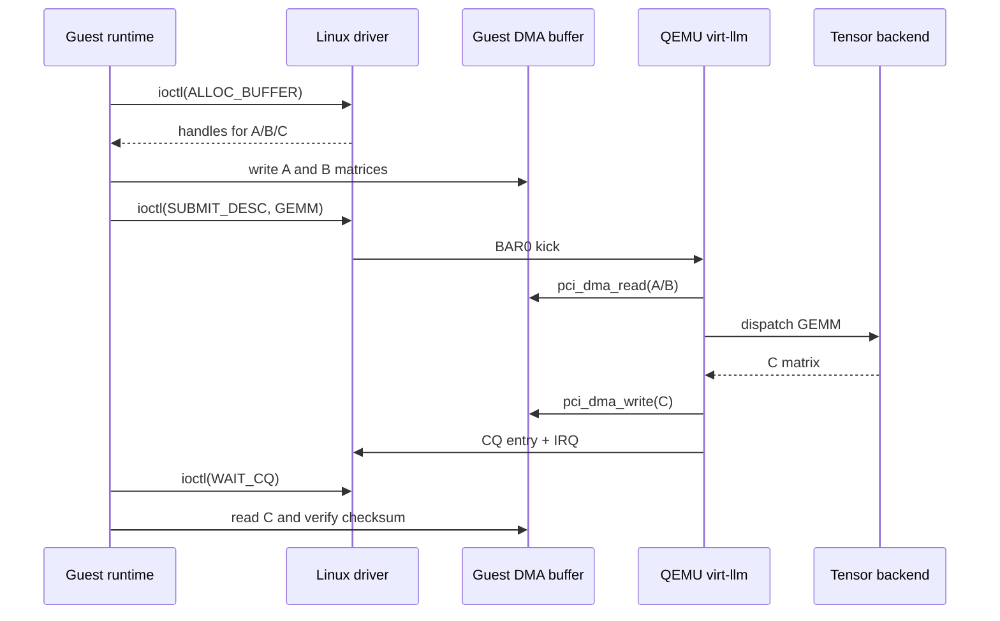

# virt-llm Platform Architecture

Last updated: 2026-06-08

## 1. Platform Boundary

The `virt-llm` platform has three layers:

1. **Host/QEMU**: runs the QEMU process and models the RISC-V CPU, virt machine,
   PCIe root complex, and `virt-llm` PCIe endpoint.
2. **Guest/Linux 6.12**: runs a riscv32 or riscv64 Linux kernel and probes the
   `virt_llm_pci` driver.
3. **Guest userspace/runtime**: submits commands through `/dev/virt_llm0` for
   GEMM, attention, or Qwen op-graph execution.

Supported guest CPUs:

| Guest | QEMU binary | Linux build | Current use |
|---|---|---|---|
| riscv32 | `qemu-system-riscv32` | `linux-6.12-build-rv32` | Main correctness path, including Qwen exact-match |
| riscv64 | `qemu-system-riscv64` | `linux-6.12-build-rv64` | Platform expansion path, covering boot/probe/GEMM/attention |

## 2. High-Level Architecture



## 3. Control Flow

Basic validation flow:

1. QEMU boots a RISC-V virt machine.
2. Linux 6.12 starts in the guest.
3. The guest PCI subsystem enumerates the `virt-llm` endpoint.
4. The `virt_llm_pci` driver probes the device.
5. The driver reads BAR0 capability registers.
6. The driver allocates submit queue, completion queue, and DMA buffers.
7. The driver or guest userspace fills command descriptors.
8. The driver writes BAR0 queue registers and kicks the doorbell.
9. The QEMU device model reads descriptors from guest memory.
10. QEMU dispatches by opcode to the correct backend.
11. The backend computes the result.
12. QEMU writes a completion queue entry and raises an interrupt.
13. The driver/runtime reads the completion and verifies the result.

## 4. Data Flow

GEMM example:



`pci_dma_read()` and `pci_dma_write()` are QEMU device-model APIs. They access
guest physical memory from the host QEMU process. The current implementation is
not a device DDR/SRAM zero-copy model: most operations copy data from guest DMA
memory into QEMU host heap, compute on host CPU, then copy results back to guest
DMA memory.

## 5. Backend Mapping

| Backend | Typical opcodes | Current role |
|---|---|---|
| DMA/metadata | `DMA_COPY`, `MODEL_LOAD`, `MODEL_QUERY` | Metadata, model loading, simple memory movement |
| Scalar dispatcher | kernel metadata validation | Command parsing and kernel dispatch simulation |
| Vector backend | vector add, softmax, pooling, RMSNorm, RoPE, SwiGLU, argmax | Elementwise and normalization-style operations |
| Tensor backend | GEMM, CONV2D, attention, LM head, Qwen GQA attention | Matrix multiply, attention, projection-style operations |

## 6. PCIe and BAR Model

The QEMU device model lives in:

```text
hw/misc/virt_llm.c
```

Hardware abstractions:

- BAR0: MMIO register space.
- BAR1: MSI-X table/PBA.
- Submit queue: command descriptor ring in guest memory.
- Completion queue: completion ring in guest memory.
- IRQ: INTx/MSI/MSI-X completion and error notification.
- Model state: Qwen safetensors loading and tensor table.
- Backend state: DMA/scalar/vector/tensor dispatch.

## 7. riscv64 Support Strategy

riscv64 support reuses the same `virt-llm` PCIe endpoint. It does not create a
separate device.

1. QEMU builds both `riscv32-softmmu` and `riscv64-softmmu`.
2. Linux builds separate rv32 and rv64 Images.
3. initramfs generation selects `rv32imac/ilp32` or `rv64imac/lp64` from
   `VIRT_LLM_GUEST_BITS`.
4. validation selects `qemu-system-riscv32` or `qemu-system-riscv64`.
5. basic gates check probe/GEMM/attention/boot markers for both guests.

The value of this strategy is that the device model, driver, and userspace ABI
are shared where possible. The 32/64-bit differences are exposed in Linux ABI,
DMA addresses, structure layout, and syscall paths.

## 8. Hardware Not Modeled Yet

The current platform does not fully model:

- device-side DDR timing;
- SRAM banks, bank conflicts, or bandwidth limits;
- tensor-core pipeline latency;
- real vector processor ISA/binary execution;
- PCIe link bandwidth/latency;
- power or thermal behavior;
- CUDA/RTX hardware backend.

The current goal is correctness of control flow, data flow, driver/runtime ABI,
and operator behavior.

## 9. Near-Term Evolution

1. Keep riscv64 in the regular fresh-clone gate.
2. Keep Qwen 8-token exact-match as the riscv32 correctness baseline.
3. Add per-layer golden checksums to locate numeric divergence.
4. Add KV cache, device memory arena, and SRAM scratchpad abstractions.
5. Add async command worker, queue backpressure, and latency traces.
6. Add BF16/Q8/Q16 dtype paths while preserving FP32 correctness.
