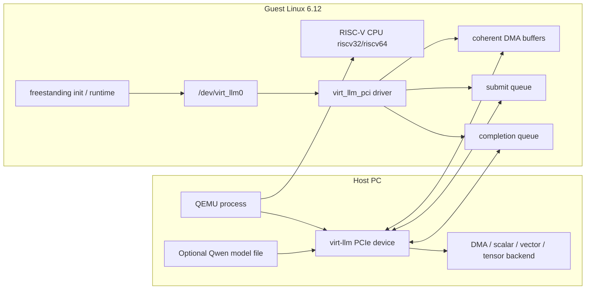
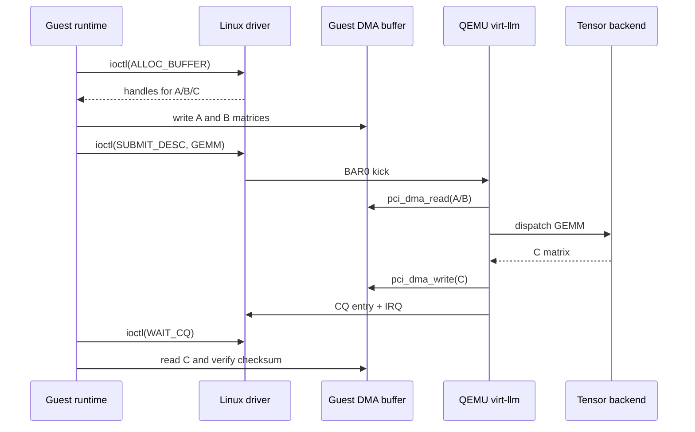

# virt-llm 平台架构说明

生成时间：2026-06-07

## 1. 平台边界

`virt-llm` 平台由三部分组成：

1. **Host/QEMU**：运行 QEMU 进程，模拟 RISC-V CPU、virt machine、PCIe root complex 和 `virt-llm` PCIe endpoint。
2. **Guest/Linux 6.12**：运行 riscv32 或 riscv64 Linux kernel，加载 `virt_llm_pci` driver。
3. **Guest userspace/runtime**：通过 `/dev/virt_llm0` 提交命令，执行 GEMM、attention 或 Qwen op graph。

当前平台支持两类 guest CPU：

| Guest | QEMU binary | Linux build | 用途 |
|---|---|---|---|
| riscv32 | `qemu-system-riscv32` | `linux-6.12-build-rv32` | 当前主验证路径，覆盖 Qwen exact-match |
| riscv64 | `qemu-system-riscv64` | `linux-6.12-build-rv64` | CPU/平台扩展路径，覆盖 boot/probe/GEMM/attention |

## 2. 总体架构



## 3. 控制流

基础 GEMM/attention validation 控制流：

1. QEMU 启动 RISC-V virt machine。
2. Linux 6.12 kernel 启动。
3. PCI 子系统枚举 `virt-llm` endpoint。
4. `virt_llm_pci` driver probe。
5. driver 读取 BAR0 capability register。
6. driver 分配 submit queue、completion queue、DMA buffer。
7. driver 或 userspace 填写 command descriptor。
8. driver 写 BAR0 doorbell/kick。
9. QEMU `virt-llm` 设备读取 descriptor。
10. QEMU 按 opcode 分发到对应 backend。
11. backend 完成计算后写 CQ entry。
12. QEMU 触发中断。
13. driver/userspace 读取 completion，校验结果。

## 4. 数据流

以 GEMM 为例：



`pci_dma_read()` / `pci_dma_write()` 是 QEMU 设备模型侧 API，语义是从 QEMU 进程中访问 guest physical address 对应的内存。当前不是 device DDR/SRAM zero-copy 模型：多数 op 会把 guest DMA buffer 内容 copy 到 QEMU host heap，计算后再 copy 回 guest DMA output buffer。

## 5. Backend 分工

| Backend | 典型 opcode | 当前作用 |
|---|---|---|
| DMA/metadata | `DMA_COPY`、`MODEL_LOAD`、`MODEL_QUERY` | 元数据、模型加载、简单搬运 |
| Scalar dispatcher | kernel metadata validation | 模拟 command queue 解析和 kernel dispatch |
| Vector backend | vector add、softmax、pooling、RMSNorm、RoPE、SwiGLU、argmax | 标量/向量类逐元素或归一化计算 |
| Tensor backend | GEMM、CONV2D、attention、LM head、Qwen GQA attention | 矩阵乘、attention、投影类计算 |

## 6. PCIe/BAR 抽象

`virt-llm` 是一个 QEMU PCIe endpoint，核心实现位于：

```text
hw/misc/virt_llm.c
```

主要硬件抽象：

- BAR0：MMIO register space。
- BAR1：MSI-X table/PBA。
- Submit queue：guest memory 中的 command descriptor ring。
- Completion queue：guest memory 中的 completion ring。
- IRQ：INTx/MSI/MSI-X completion/error notification。
- Model state：Qwen safetensors 权重加载和 tensor table。
- Backend state：DMA/scalar/vector/tensor dispatch。

## 7. riscv64 支持策略

riscv64 支持不是新增一个独立设备，而是复用同一个 `virt-llm` PCIe endpoint：

1. QEMU 同时构建 `riscv32-softmmu` 与 `riscv64-softmmu`。
2. Linux 分别构建 rv32/rv64 Image。
3. initramfs 根据 `VIRT_LLM_GUEST_BITS` 选择 `rv32imac/ilp32` 或 `rv64imac/lp64`。
4. validation 根据 guest bits 自动选择 `qemu-system-riscv32` 或 `qemu-system-riscv64`。
5. 基础 gate 对两种 guest 都检查 probe/GEMM/attention/boot marker。

这样做的优点是设备模型、driver 和 userspace ABI 尽量共用，真正暴露 32/64 位差异的位置集中在 Linux ABI、DMA address、结构体布局和 syscall path。

## 8. 当前没有模拟的硬件

当前平台没有完整模拟：

- device-side DDR timing；
- SRAM bank、bank conflict、带宽限制；
- tensor core pipeline latency；
- vector processor ISA/binary execution；
- PCIe link bandwidth/latency；
- power/thermal 行为；
- CUDA/RTX 作为硬件 backend。

现阶段目标仍是控制流、数据流、driver/runtime ABI 和算子正确性。

## 9. 后续演进

后续优先级：

1. riscv64 路径纳入常规 fresh clone gate。
2. Qwen 8-token exact-match 继续作为 riscv32 correctness baseline。
3. 增加 per-layer golden，定位数值分叉。
4. 引入 KV cache、device memory arena、SRAM scratchpad。
5. 引入异步 worker、queue backpressure、latency trace。
6. 扩展 BF16/Q8/Q16 dtype，并保留 FP32 correctness baseline。
