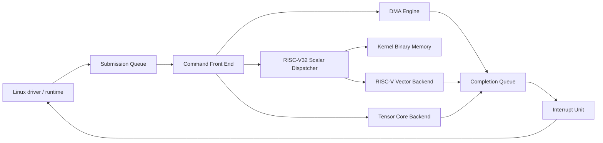
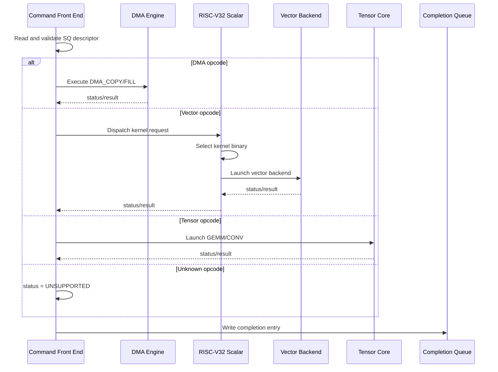

# virt-llm RISC-V32 Scalar Dispatcher Architecture

## Goal

The next accelerator generation introduces an internal RISC-V32 scalar control
processor. The command queue front end still owns PCIe-facing command parsing,
ownership checks, and completion queue writes. The scalar processor becomes the
firmware/kernel dispatcher for vector-oriented kernels.

The hardware model is:

- command queue front end parses descriptors and validates ABI fields;
- simple DMA commands are executed directly by the DMA engine;
- vector-style commands are dispatched to an internal RISC-V32 scalar CPU;
- the scalar CPU loads or selects a kernel binary and launches the simulated
  RISC-V vector backend;
- GEMM and CONV commands bypass the vector dispatcher and go to the tensor core;
- every command writes a completion queue entry.

## Hardware Blocks

## Dispatch Policy

| Opcode class | Front-end action | Execution block |
| --- | --- | --- |
| DMA commands | Decode and execute directly | DMA engine |
| Vector add / dot / softmax / pooling | Create scalar dispatch request | RISC-V32 scalar dispatcher plus vector backend |
| GEMM / CONV | Create tensor request | Tensor core backend |
| Unknown opcode | Complete with unsupported opcode | CQ error completion |

The scalar dispatcher is not a full guest-visible CPU. It is an internal
accelerator controller. In QEMU phase 1 it will be a deterministic state machine
that consumes a compact kernel descriptor. Later it can grow toward executing
actual RISC-V32 code or a tiny bytecode interpreter.

## Data Flow

### DMA command

1. Front end reads SQ descriptor.
2. Front end validates input/output address and length.
3. DMA engine reads source and writes destination through PCI DMA helpers.
4. Front end writes CQ entry and raises interrupt.

### Vector command

1. Front end reads SQ descriptor.
2. Front end validates vector command arguments.
3. Front end builds a scalar dispatch request:
   - command id;
   - opcode;
   - kernel id;
   - input/output DMA addresses;
   - element count;
   - packed arguments.
4. RISC-V32 scalar dispatcher selects a kernel binary by `kernel_id`.
5. Scalar dispatcher validates that the kernel supports the opcode.
6. Scalar dispatcher calls the vector backend simulation.
7. Vector backend performs deterministic math and returns status/result.
8. Front end writes CQ entry.

### Tensor command

1. Front end reads SQ descriptor.
2. Front end validates tensor dimensions and addresses.
3. Tensor core backend executes GEMM or CONV simulation.
4. Front end writes CQ entry.

## Control Flow

## ABI Extension Plan

The current 64-byte descriptor remains valid. Reserved fields are assigned
stable meanings for dispatcher commands:

| Descriptor field | Meaning |
| --- | --- |
| `opcode` | command opcode |
| `flags` | ownership and command flags |
| `input_addr` | first input buffer |
| `output_addr` | output buffer |
| `len` | byte count or element count |
| `status` | inline compatibility status |
| `result` | checksum or scalar result |
| `rsvd0` | command id |
| `rsvd1` | second input address or kernel binary address |
| `rsvd2` | packed dimensions or vector/tensor args |
| `rsvd3` | kernel id and backend-specific flags |

For scalar-dispatched vector commands, `rsvd3` is interpreted as:

| Bits | Name | Meaning |
| --- | --- | --- |
| 0..15 | `kernel_id` | Scalar dispatcher kernel selector |
| 16..23 | `kernel_abi` | Kernel ABI version |
| 24..31 | `dispatch_flags` | Future async/debug flags |

Initial kernel ids:

| Kernel id | Name | Supports |
| --- | --- | --- |
| `1` | `vec_add_u32` | `VECTOR_ADD_U32` |
| `2` | `dot_u32` | `DOT_U32` |
| `3` | `softmax_q16` | `SOFTMAX_Q16` |
| `4` | `pool_max_u32` | `POOL_MAX_U32` |

Tensor commands do not use the scalar dispatcher. GEMM and CONV are routed to
the tensor core by opcode.

## Register Extension Plan

Add read-only scalar dispatcher capability registers:

| Offset | Name | Purpose |
| --- | --- | --- |
| `0x64` | `SCALAR_STATUS` | idle/running/error state |
| `0x68` | `SCALAR_KERNELS` | number of built-in kernels |
| `0x6c` | `SCALAR_LAST_KERNEL` | last selected kernel id |
| `0x70` | `SCALAR_LAST_OPCODE` | last scalar-dispatched opcode |

Feature bit:

- `FEATURE_SCALAR_DISPATCH`: internal RISC-V32 scalar dispatcher exists.

Completion queue backend values:

| Backend id | Meaning |
| --- | --- |
| `0` | compatibility |
| `1` | DMA engine |
| `2` | RISC-V vector backend |
| `3` | tensor core |
| `4` | RISC-V32 scalar dispatcher |

For vector commands, CQ should report backend `4` once the scalar dispatcher is
introduced. The CQ result still reflects the vector backend output checksum.

## Implementation Phases

### Phase 1: Scalar Dispatcher Skeleton

QEMU:

- Add scalar dispatcher state fields.
- Add scalar capability/status registers.
- Add feature bit for scalar dispatch.
- Route vector opcodes through `virt_llm_scalar_dispatch()`.
- Keep the existing vector backend math helpers unchanged.
- CQ reports backend `SCALAR` for scalar-routed vector commands.

Linux:

- Read scalar capability registers.
- Set kernel id in `rsvd3` for vector add, softmax, and pooling.
- Verify CQ backend is scalar for vector commands.

Validation:

- Existing vector add, softmax, and pooling tests still pass.
- Logs show scalar status, last kernel id, and last opcode.

### Phase 2: Dot Product Kernel

Status: implemented and validated.

QEMU:

- Add opcode `DOT_U32`.
- Add kernel id `dot_u32`.
- Scalar dispatcher routes dot product to vector backend helper.

Linux:

- Add known-answer dot product test.

### Phase 3: Tensor Core CONV

QEMU:

- Add opcode `CONV2D_U32`.
- Route directly to tensor core backend.
- Reuse packed shape arguments in descriptor `rsvd2` and `rsvd3`.

Linux:

- Add a tiny known-answer 2D convolution test.

### Phase 4: Kernel Binary Table

QEMU:

- Add a small internal kernel table with fake binary metadata:
  - kernel id;
  - entry point;
  - supported opcode;
  - ABI version;
  - binary byte array.
- Scalar dispatcher validates the kernel table before launching backend helper.

Linux:

- Query built-in kernel count and last kernel id through registers.

### Phase 5: External Kernel Upload

QEMU:

- Add optional DMA-loadable kernel binary region.
- Add command to register or update a kernel slot.
- Validate size, ABI, and checksum.

Linux/userspace:

- Add an upload path later through driver ioctl or debugfs.

This phase should wait until the front-end queues and userspace API are more
stable.
